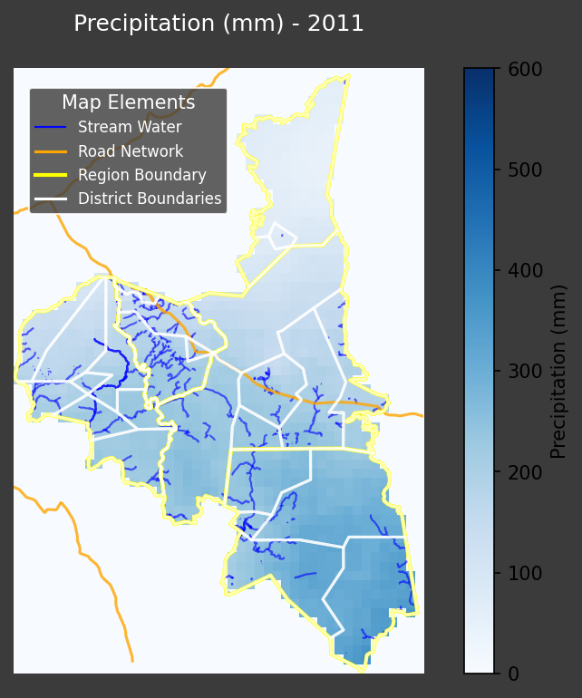
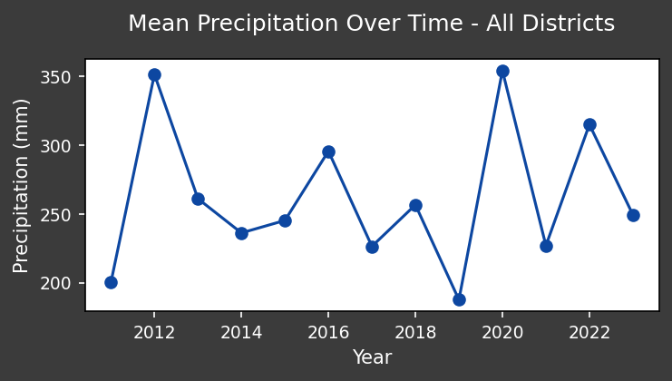
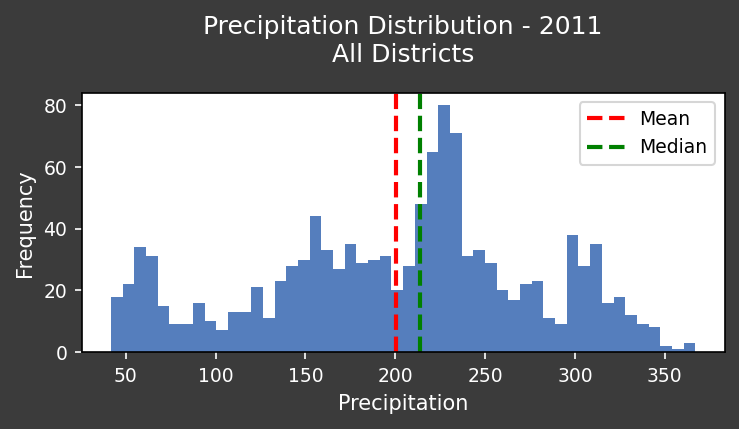

# Environmental Analysis Report: Assaba, Mauritania (2011-2023) - Precipitation in 2011

**Introduction**

Environmental degradation in regions like Assaba, Mauritania, poses significant challenges for NGOs and international organizations focused on humanitarian aid and sustainable development. Understanding environmental dynamics, particularly precipitation patterns, is crucial for effective intervention strategies. This report analyzes precipitation data for Assaba in 2011 to inform targeted responses and promote collaboration among stakeholders. Monitoring precipitation helps identify drought-prone areas, assess agricultural productivity, and anticipate potential water scarcity issues, enabling proactive and data-driven decision-making.

**Data Overview**

This report focuses on precipitation data for Assaba, Mauritania, during the year 2011. Data covers all districts within the Assaba region. The analysis aims to identify areas with particularly low or high precipitation relative to the regional average, providing insights into potential environmental stress points.

**Visualizations**

*   **Map of Precipitation:**

    

    The map visualizes the spatial distribution of precipitation across the Assaba region in 2011. Variations in color indicate differences in precipitation levels, allowing for easy identification of areas experiencing drought or abundant rainfall.

*   **Precipitation Trend:**

    

    This plot shows the temporal trend of precipitation throughout 2011. It highlights seasonal variations and any significant deviations from the average, providing a historical context for understanding current conditions.

*   **Precipitation Statistics:**

    

    The statistics plot provides summary statistics, such as mean, median, and standard deviation, of precipitation across the Assaba region in 2011. This allows for quantitative comparison and identification of districts with statistically significant differences in rainfall.

**Analysis of Precipitation in 2011**

Based on the available data, precipitation patterns in Assaba during 2011 exhibited the following key characteristics:

*   **Spatial Variability:** The map plot shows considerable spatial variation in precipitation across different districts. Some areas received significantly less rainfall than others, indicating a higher risk of drought and water scarcity.
*   **Temporal Trends:** The trend plot shows seasonal fluctuations, with peak rainfall occurring during the wet season and prolonged dry periods during the rest of the year. This pattern is typical for the region but understanding the intensity and duration of these seasons is critical.
*   **Statistical Significance:** The statistics plot reveals the mean and standard deviation of rainfall across the districts. Districts with rainfall significantly below the regional average require focused intervention.

**Actionable Insights and Recommendations**

*   **Targeted Humanitarian Aid:** Areas identified with low precipitation require immediate humanitarian aid, including water distribution, drought-resistant crop promotion, and livestock support.
*   **Restoration and Conservation Projects:** Implement water conservation strategies, such as rainwater harvesting and improved irrigation techniques, in drought-prone districts. Reforestation efforts can also help improve water retention and prevent desertification.
*   **International Collaboration:** Share these findings with international partners to mobilize resources and coordinate intervention efforts. Advocate for sustainable land management policies to address the root causes of environmental degradation.
*   **Community Engagement:** Engage local leaders and communities in the planning and implementation of environmental projects to ensure their sustainability and effectiveness.
*   **Further Research:** Conduct further research into the correlation between precipitation, land cover changes, and GPP to understand the long-term impact of rainfall variability on ecosystem health and agricultural productivity. This analysis can guide more informed environmental strategies and investment decisions.

**Conclusion**

Analyzing precipitation data for Assaba in 2011 provides valuable insights for NGOs and international organizations seeking to address environmental challenges and improve humanitarian outcomes. By combining data analysis with on-the-ground expertise, stakeholders can develop effective strategies to mitigate the impacts of drought, promote sustainable development, and foster a more resilient future for the Assaba region.
