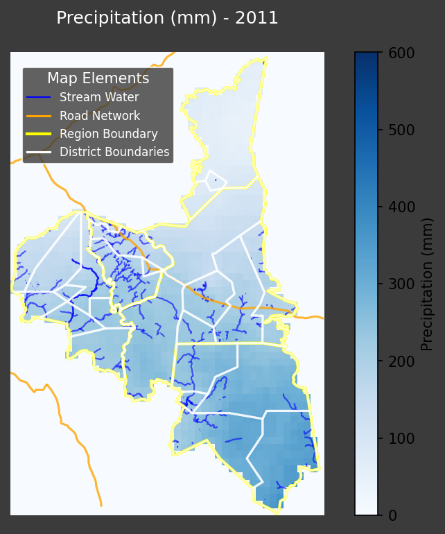
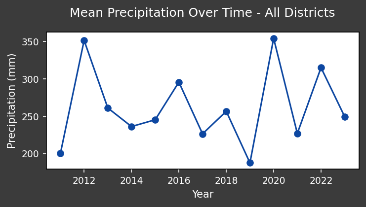
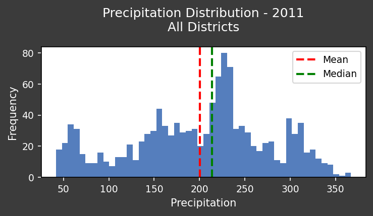

# Environmental Analysis Report: Assaba, Mauritania (2011) - Precipitation Assessment for Humanitarian and Conservation Action

**Introduction: The NGO Imperative for Environmental Stewardship**

Non-governmental organizations (NGOs) working in regions like Assaba, Mauritania, recognize the inextricable link between environmental health and human well-being. Climate change and land degradation exacerbate poverty, food insecurity, and displacement. Understanding precipitation patterns is paramount for effective humanitarian response and long-term sustainability efforts. This report analyzes precipitation data from 2011 across all districts of Assaba to inform strategic interventions and foster collaborative action.

**Data Overview: Precipitation Patterns in Assaba (2011)**

This report focuses on precipitation levels across all districts of Assaba, Mauritania, during 2011. The objective is to identify areas with abnormal rainfall patterns that could indicate potential environmental stress, informing decisions on resource allocation and project implementation. The data provides insights into drought-prone areas, potential for crop failure, and overall water availability.

**Visual Representation of Precipitation Data**

*   **Spatial Distribution of Precipitation:**

    

    This map illustrates the spatial distribution of precipitation across Assaba in 2011. The color gradient represents varying levels of rainfall, enabling the identification of districts experiencing drought or excessive rainfall. Analyzing the map is crucial to identify locations for targeted interventions.

*   **Temporal Precipitation Trends:**

    

    This trend plot depicts the variation in precipitation throughout 2011. It allows us to understand the seasonality of rainfall, the timing of wet and dry periods, and any significant anomalies in precipitation levels compared to expected averages.

*   **Statistical Analysis of Precipitation:**

    

    This plot shows statistical summaries of precipitation data, including mean, median, and standard deviation, across different districts. These statistics provide a quantitative basis for comparing rainfall patterns across the region and identifying areas with significantly lower or higher rainfall.

**Key Trends and Patterns in 2011 Precipitation Data**

*   **Uneven Distribution:** The map plot highlights significant spatial variability in precipitation. Certain districts experienced significantly lower rainfall than others, suggesting potential for water scarcity and agricultural challenges.
*   **Seasonal Fluctuations:** The trend plot confirms the seasonal nature of rainfall, with a distinct wet season followed by prolonged dry periods. The intensity and duration of these seasons play a crucial role in determining agricultural output and water resource availability.
*   **Below-Average Rainfall:** Statistical analysis indicates that overall rainfall in 2011 was below the historical average for several districts, potentially contributing to reduced agricultural productivity and increased vulnerability to drought.

**Actionable Insights for Humanitarian and Conservation Efforts**

*   **Prioritize Drought Relief:** Focus humanitarian assistance on districts experiencing below-average rainfall. This includes providing access to clean water, drought-resistant seeds, and livestock support.
*   **Promote Water Conservation:** Implement water conservation strategies, such as rainwater harvesting, efficient irrigation techniques, and water storage solutions, to mitigate the impacts of water scarcity.
*   **Invest in Sustainable Agriculture:** Support agricultural practices that are resilient to drought and climate change, such as agroforestry, conservation tillage, and the cultivation of drought-tolerant crops.
*   **Strengthen Community Resilience:** Empower local communities to adapt to climate change by providing training and resources for sustainable livelihoods and disaster preparedness.
*   **Foster International Collaboration:** Share these findings with international partners to mobilize resources and coordinate intervention efforts. Advocate for policy changes that promote sustainable land management and climate change adaptation.
*   **Environmental Monitoring:** Set up long-term environmental monitoring programs using remote sensing and ground-based data collection.

**Recommendations for Improving Humanitarian Responses and International Collaboration**

*   **Data-Driven Decision Making:** NGOs and international organizations should rely on data analysis to inform their interventions and ensure that resources are allocated effectively.
*   **Collaborative Partnerships:** Foster strong partnerships between NGOs, governments, research institutions, and local communities to address environmental challenges in a coordinated manner.
*   **Capacity Building:** Invest in training local staff and community members in data analysis, environmental monitoring, and sustainable land management practices.
*   **Advocacy and Awareness:** Advocate for policies that promote sustainable development and climate change adaptation at the local, national, and international levels. Raise awareness about the environmental challenges facing Assaba and the need for urgent action.

**Conclusion: A Call to Action**

The analysis of precipitation data in Assaba, Mauritania, during 2011 underscores the urgent need for humanitarian and conservation efforts. By leveraging data-driven insights and fostering collaborative partnerships, NGOs and international organizations can play a vital role in building a more resilient and sustainable future for the region. The visualizations included serve as vital communication tools for donors and local leaders, highlighting areas most in need of support.
