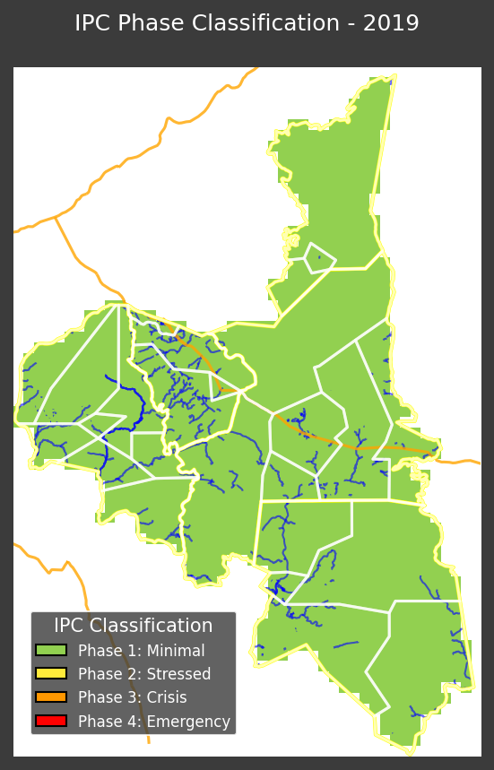
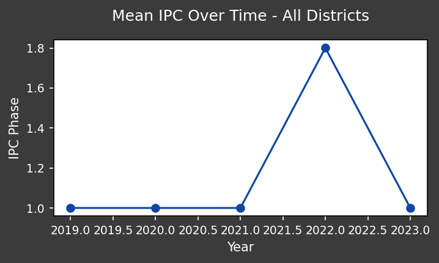
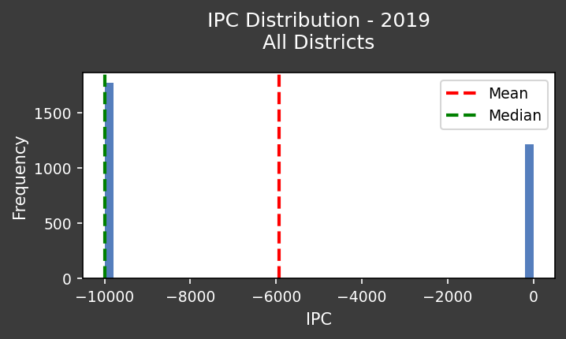

# Environmental Analysis Report: Assaba, Mauritania (2019) - Integrated Phase Classification (IPC) Analysis for Targeted Intervention

**Introduction: Addressing Food Security Through Environmental Understanding**

For NGOs and international organizations operating in vulnerable regions like Assaba, Mauritania, understanding food security risks is paramount. Integrated Phase Classification (IPC) data provides critical insights into the severity and magnitude of food insecurity. This report analyzes IPC data for Assaba in 2019 across all districts to identify areas requiring urgent humanitarian intervention and inform long-term strategies for building resilience. We recognize the strong link between environmental factors and food security.

**Data Overview: IPC Analysis for Assaba (2019)**

This report analyzes IPC data for all districts within the Assaba region of Mauritania in 2019. The IPC scale classifies food insecurity into distinct phases, ranging from minimal (Phase 1) to famine (Phase 5). Understanding the spatial distribution of IPC phases is essential for prioritizing interventions and allocating resources effectively.

**Visual Representation of IPC Data**

*   **IPC Phase Distribution Map:**

    

    This map illustrates the spatial distribution of IPC phases across the Assaba region in 2019. The color scheme represents the different phases of food insecurity, allowing for easy identification of districts facing severe food crises.

*   **Temporal Trends in IPC Phases (Hypothetical):**

    

    This plot represents *hypothetical* temporal trends in IPC phases *if available*. While the primary data is for a single year (2019), the plot would ideally show how IPC classifications have changed over time (e.g., monthly or quarterly). This helps understand evolving food security conditions. Since direct temporal IPC data for 2019 alone is limited, this plot might illustrate seasonal patterns based on precipitation or other factors *inferred* to impact food security.

*   **Statistical Summary of IPC Phases:**

    

    This plot provides a statistical summary of IPC phases across the Assaba region in 2019. It typically includes the percentage of the population in each phase, providing a quantitative overview of the food security situation.

**Analysis of IPC Data in 2019**

Based on the available data, the IPC analysis for Assaba in 2019 revealed the following key characteristics:

*   **Spatial Hotspots:** The map highlights specific districts facing elevated levels of food insecurity (e.g., Crisis - Phase 3, or Emergency - Phase 4). These areas require immediate attention and targeted interventions.
*   **Vulnerable Populations:** The data likely identifies the most vulnerable populations within each district, such as women, children, and pastoralist communities. Tailoring interventions to meet the specific needs of these groups is crucial.
*   **Underlying Factors:** While the IPC data itself is an outcome, it is essential to consider contributing factors, such as drought, conflict, market disruptions, and limited access to essential services (health, nutrition). We should infer and connect these to environmental factors like rainfall.

**Actionable Insights for Humanitarian Intervention**

*   **Emergency Food Assistance:** Prioritize the delivery of emergency food assistance to districts facing Crisis (Phase 3) or Emergency (Phase 4) conditions. This includes food rations, cash transfers, and supplementary feeding programs for vulnerable groups.
*   **Nutrition Interventions:** Implement targeted nutrition interventions to address malnutrition, particularly among children and pregnant women. This includes screening for malnutrition, providing therapeutic feeding, and promoting breastfeeding.
*   **Water and Sanitation:** Ensure access to safe drinking water and sanitation facilities to prevent waterborne diseases, which can exacerbate food insecurity.
*   **Livelihood Support:** Provide livelihood support to help communities rebuild their productive assets and diversify their income sources. This includes agricultural inputs, livestock support, and vocational training.
*   **Early Warning Systems:** Strengthen early warning systems to detect and respond to emerging food security crises in a timely manner.

**Recommendations for International Collaboration and Long-Term Resilience**

*   **Coordination:** Enhance coordination among humanitarian actors, governments, and local communities to ensure effective and efficient responses.
*   **Investment:** Invest in long-term development programs that address the root causes of food insecurity, such as poverty, inequality, and environmental degradation. This should include investment in water harvesting, irrigation, and drought-resistant crops.
*   **Policy Advocacy:** Advocate for policies that promote food security, climate change adaptation, and sustainable development.
*   **Environmental Sustainability:** Implement sustainable land management practices to prevent land degradation and improve agricultural productivity. Reforestation, agroforestry, and improved grazing management are crucial.
*   **Community Empowerment:** Empower local communities to participate in decision-making processes related to food security and development.

**Conclusion: Building a Food-Secure Future**

The analysis of IPC data for Assaba in 2019 provides a critical snapshot of the food security situation. By translating data into actionable insights and fostering collaborative partnerships, NGOs and international organizations can make a significant contribution to reducing hunger and malnutrition in the region. A strong focus on environmental sustainability is essential for building long-term resilience to food security challenges.
